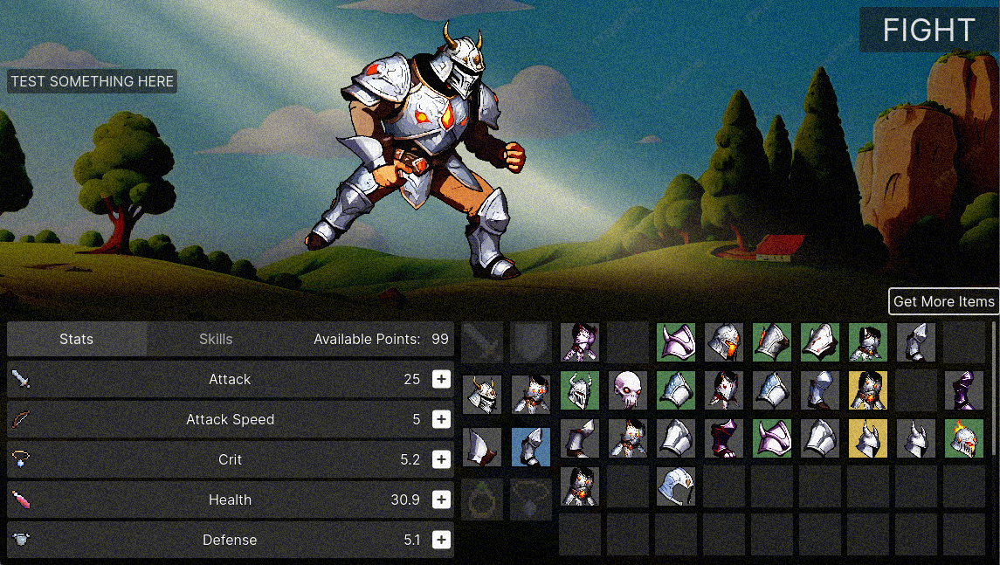

Welcome to "Gear to Glory", an immersive RPG Auto Battler where strategy, customization, and epic battles define your path to victory. Embark on a journey through mystical lands, equip your heroes with the mightiest armor, and clash against formidable foes in automated strategic combat.



## Features

- **Dynamic Auto-Battler Combat**: Set your strategies and watch your heroes take on monsters and bosses in thrilling automatic battles.
- **Extensive Gear Customization**: Hundreds of unique armor pieces, weapons, and accessories to equip your heroes with, each affecting your battle strategy in different ways.
- **Epic Quests and Adventures**: Travel across diverse landscapes, from the dark dungeons of the Underworld to the lofty peaks of the Sky Kingdom, completing quests and uncovering rare gear.
- **Hero Progression**: Level up your heroes, enhance their abilities, and unlock special skills that can turn the tide of battle.
- **Engaging Storyline**: Immerse yourself in the rich lore of "Gear to Glory", where every piece of gear has its history and every hero their tales.
- **Multiplayer Battles**: Challenge other players in competitive auto-battler matches to test your strategy and gear combinations.

## Getting Started

To dive into "Gear to Glory", follow these simple steps:

1.  **Clone the repository**:
    
    ```bash
    git clone https://github.com/dashw00d/gear-to-glory.git
    ```
    
2.  **Navigate to the project directory**:
    
    ```bash
    cd gear-to-glory
    ```
    
3.  **Run the game** (make sure you have [Godot Engine](https://godotengine.org/download "Godot Engine") installed):
    
    ```bash
    godot .
    ```
    

## Contribution

Interested in contributing to "Gear to Glory"? We welcome contributions of all forms, from bug fixes and feature suggestions to new gear designs and story expansions. Please read through our [CONTRIBUTING.md](CONTRIBUTING.md "CONTRIBUTING.md") for guidelines on how to make a contribution.

## Support

Encountered a bug or have a question? Open an issue on our [GitHub issues page](https://github.com/dashw00d/gear-to-glory/issues "GitHub issues page"), and we'll get back to you as soon as possible.

## License

"Gear to Glory" is licensed under the [MIT License](LICENSE "MIT License"). Feel free to fork, modify, and use it in your projects according to the license terms.

## Acknowledgments

- Special thanks to [Godot Engine](https://godotengine.org "Godot Engine") for making game development accessible and fun.
- To our amazing community of players and contributors - thank you for making "Gear to Glory" what it is!

Gear up, strategize, and may glory be yours!